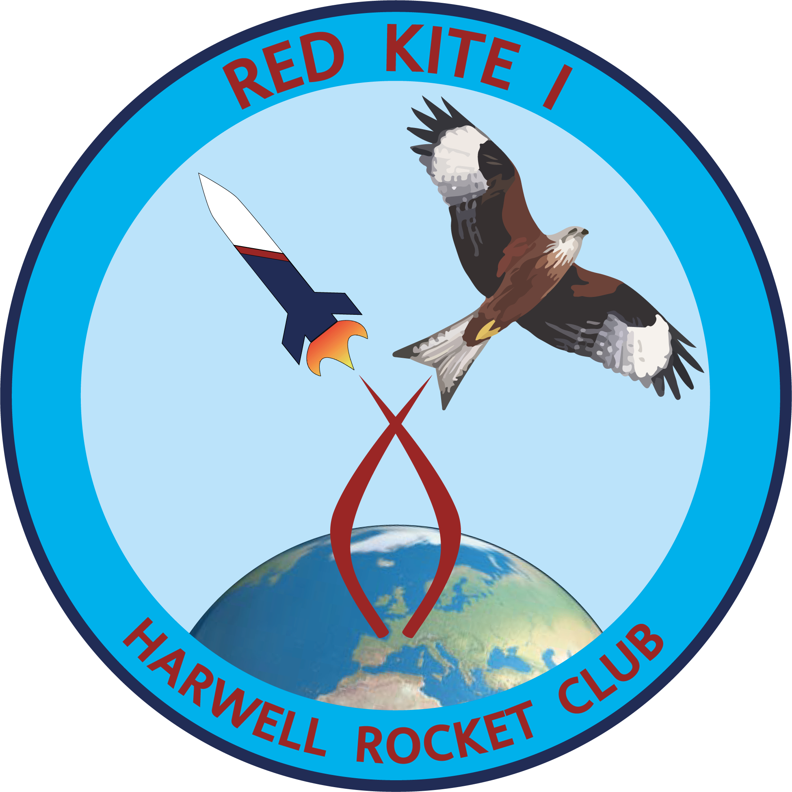

{{ site.red_kite_description }}

The series of rockets will be used in our outreach strategy, with the intention to inspire children, students and adults of all ages and backgrounds. The name was suggested by the RAL Space communications team. RedKite follows the bird theme of previous UK rockets, and can also be found in the skies here at Harwell. The name choice also represents the rebirth of the UK rocketry industry following the near extinction of the RedKite bird, which resiliently bounced back.

## RedKite-I 

Aim: Dual Stage Recovery Demonstration



### Meet The Team



